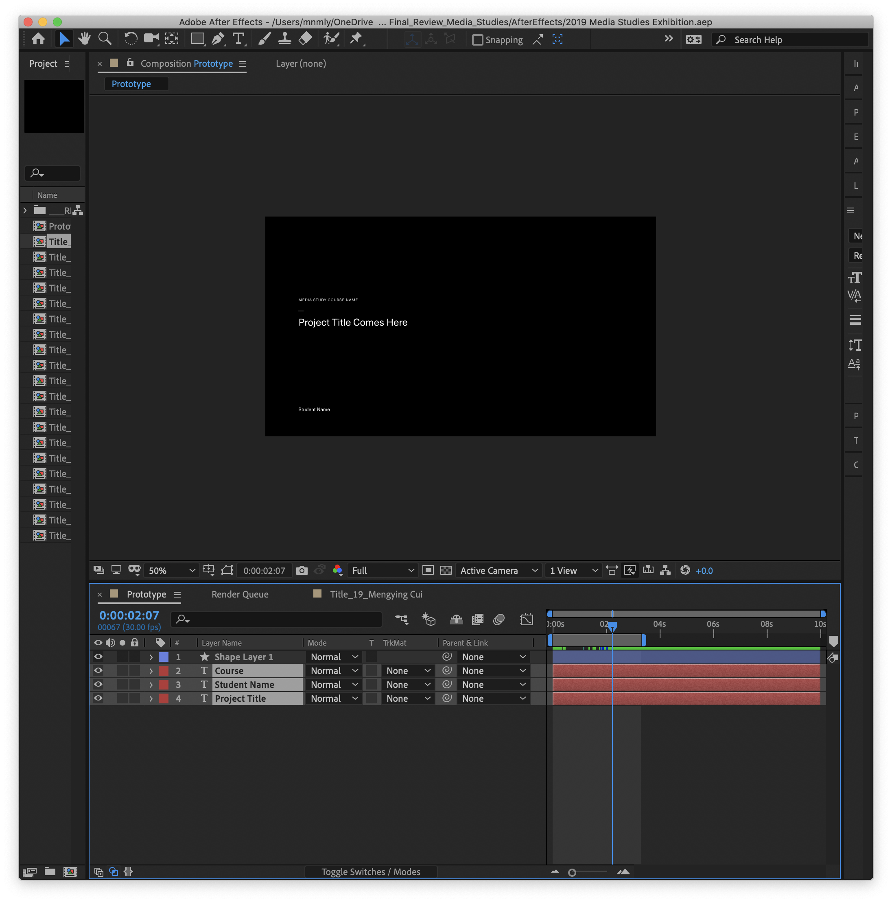

# AfterEffects Clone Comp

Duplicate `Prototype` comp, and fill out the text layer based on the JSON data entries.



 

### Usage

- Select `Comp-Cloner.jsx` from `File` → `Script` → `Run Script File…`
- Then select JSON file when prompt pops up.

### Sample JSON

```json
[
	{
		"ID": "001",
		"Course": "Course Name A",
		"Student Name": "student name 1",
		"Project Title": "Project Title X"
	},
	{
		"ID": "002",
		"Course": "Course Name B",
		"Student Name": "student name 2",
		"Project Title": "Project Title Y"
	}
]
```
